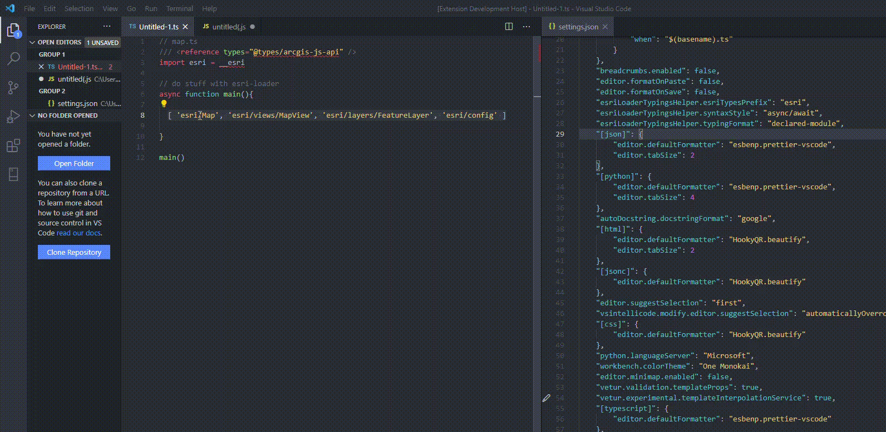

# `esri-loader-typings-helper` Plugin


This plugin is designed for usage in TypeScript or JavaScript applications complete with helpers for loading [ArcGIS JavaScript API](https://developers.arcgis.com/javascript/latest/) modules using the [esri-loader](https://github.com/Esri/esri-loader) library.  In addition to creating the `loadModules` syntax for you automatically, it will also create type annotations (based on [@types/arcgis-js-api](https://www.npmjs.com/package/@types/arcgis-js-api)) for the imported modules.  This will attempt to guess what the appropriate types are, and may require some manual tweaking.

> note: When using regular JavaScript, the typings will not be added and will just construct the regular `loadModules()` syntax.

Here is an example of how to use the esri loader:

```ts
// to use a specific version of esri-loader, include the @version in the URL for example:
import { loadModules } from "esri-loader";

const main = async () => {
  const [MapView, WebMap] = await loadModules(['esri/views/MapView', 'esri/WebMap']);
  // use MapView and WebMap classes as shown above
}
main();
```

using this plugin, you can simply just provide the array of module names to load and the plugin will do the rest by highlighting the following code:

`['esri/views/MapView', 'esri/WebMap']`

will get automatically converted to this with the appropriate typings: 

```ts
const [MapView, WebMap] = await loadModules<[__esri.MapViewConstructor, __esri.WebMapConstructor]>(["esri/views/MapView", "esri/WebMap"])
```

Just using the `esri-loader` out of the box with TypeScript, you will not actually get type inferences based on the imported modules and you will actually have to set them yourself manually if you want good auto complete help.  By default, all destructured modules will have the `any` type.  See example below:


Since this plugin will automatically add the types (or at least a quick and dirty guess), most modules should be properly typed:


> Although Esri recently released the beta version of [arcgis-js-api](https://www.npmjs.com/package/arcgis-js-api) as an npm package, it does not yet appear to have good tree shaking capabilities and therefore any applications that use it have massive bundle files, even if only using a few modules.  Therefore, in the meantime using `esri-loader` will help keep your apps smaller and handle loading the ArcGIS JavaScript API through `<script>` tag lazy loading.

## Features

This plugin will allow you to quickly generate `loadModules()` code by simply providing the string array of modules you wish to import while supporting both the `async / await` pattern or `Promise` based syntax.  An example of each is shown below:

### async/await


### promise 


### regular JavaScript


## Commands

This plugin supports two commands:

* `esri-loader Helper`: this will run the `loadModules` helper and prompt the user to choose either `async/await` or `promsie` for the syntax style.  Other options such as the `esriTypesPrefix` (defaults to `__esri`) and `typingFormat` (defaults to `constructor`) are read from this extension's settings.

* `esri-loader Helper with Defaults`: this is similar to the `esri-loader Helper` command except it will not prompt you for the `syntaxStyle` and instead will create the snippet based on what is configured in the extension's settings for the default style (`async/await` is the default out of the box).

## Requirements

This plugin is designed for usage with the [esri-loader]() package for both JavaScript and TypeScript.  When using TypeScript, you will also want to reference the [@types/arcgis-js-api](https://www.npmjs.com/package/@types/arcgis-js-api) package.

to install the `esri-loader` as a regular dependency, simply use: 

npm:

```
npm i --save esri-loader
```

yarn:
```
yarn add esri-loader
```

to install the `@types/arcgis-js-api` as a dev dependency:

npm:
```
npm i --save-dev @types/arcgis-js-api
```

yarn:
```
yarn add --dev @types/arcgis-js-api
```

And then to reference the typings, add this to the top of a TypeScript file somewhere in your app:
```ts
/// <reference types="@types/arcgis-js-api" />
```

Doing the above will allow you to access esri types via the default declared namespace of `__esri`.  For example, to get the typing for a [FeatureLayer](https://developers.arcgis.com/javascript/latest/api-reference/esri-layers-FeatureLayer.html), use:

```ts
const featureLayer: __esri.FeatureLayer = someLayer
```

## Extension Settings

This extension contributes the following settings:

* `esriLoaderTypingsHelper.esriTypesPrefix`: the default prefix alias for the [@types/arcgis-js-api](https://www.npmjs.com/package/@types/arcgis-js-api). This defaults to the default declared namespace esri uses which is `__esri`.  Examples of how to change this are shown below.

* `esriLoaderTypingsHelper.typingFormat`: the desired format for the TypeScript typings (only applicable in TypeScript projects).  The default is `constructor`, which uses will attempt to guess the appropriate type.  This is accurate most of the time, but there may require some manual tweaking in some instances.  The other safer (but more ugly) option is to use `declared-module` which will use the `typeof import("esri/Map")` format.  These typings will always be correct because they use the declared module as defined in the `@types/arcgis-js-api` typings.  See examples below.

* `esriLoaderTypingsHelper.syntaxStyle`: the syntax style.  This defaults to the `async/await` pattern and also supports regular `promise` syntax.  The differences are shown below.

### changing the `esriTypesPrefix`

To change the `esriTypesPrefix` for example going from the default `__esri` as the declared namespace from `@types/arcgis-js-api` to the alias of just `esri` you would do the following:

```ts
// map.ts
/// <reference types="@types/arcgis-js-api" />
import esri = __esri

// do stuff with esri-loader
```

And then modify the settings.json to reflect the alias:


### changing the `typingsFormat`

To change from the default `constructor` typing format to the `declared-module`, modify the propertin in the `settings.json` file for your VS Code.  Using `declared-module` as the typing format will ensure that the typings will always be correct.  This is not the default setting because the typings are not as aesthetically pleasing.

For example, the `constructor` style `__esri.FeatureLayerConstructor` becomes `typeof import("esri/layers/FeatureLayer")` as the `declared-module` style.  This is due to how the typing modules are declared in the [@types/arcgis-js-api](https://raw.githubusercontent.com/DefinitelyTyped/DefinitelyTyped/master/types/arcgis-js-api/index.d.ts):


And this is how the plugin looks when using the `declared-module` as the `typingsFormat`:




## Known Issues

At this time, when using the `constructor` option for the `esriLoaderTypingsHelper.typingFormat` setting this plugin will guess the appropriate typing by using the `__esri.<module-name>Constructor` convention unless it is a utlity module.  There is no validation check. This is probably accurate for most modules imported via the `esri-loader`, but some manual tweaking may be necessary in some cases.  If you want to avoid this potential issue, use the `declared-module` option for the `typingFormat` setting to always ensure the typings are correct.

## Changelog

Check the [CHANGELOG.md](./CHANGELOG.md) for any version changes.

## Reporting Issues

Report any issues on the github [issues](https://github.com/CalebM1987/esri-loader-typings-helper/issues) page. Follow the template and add as much information as possible.

## Contributing

The source code for this extension is hosted on [GitHub](https://github.com/CalebM1987/esri-loader-typings-helper). Contributions, pull requests, suggestions, and bug reports are greatly appreciated.

-   Post any issues and suggestions to the github [issues page](https://github.com/CalebM1987/esri-loader-typings-helper/issues). Add the `feature request` tag to any feature requests or suggestions.
-   To contribute, fork the project and then create a pull request back to master. Please update the README if you make any noticeable feature changes.
-   There is no official contribution guide or code of conduct yet, but please follow the standard open source norms and be respectful in any comments you make.